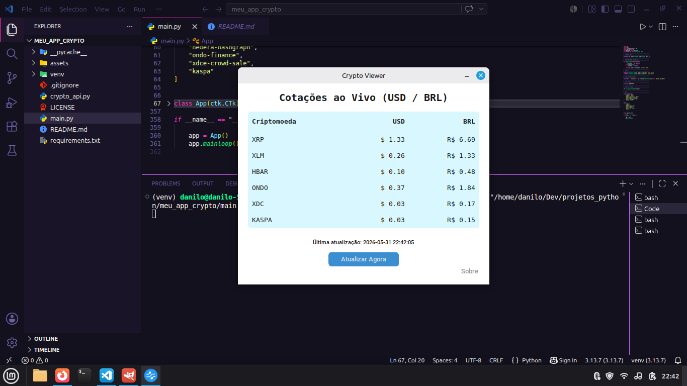

# 💠 Crypto API  


---

**Visualize preços de criptomoedas em tempo real — rápido, leve e direto ao ponto.**

---

## 🪙 Sobre o projeto  

O **Crypto API** é um aplicação minimalista desenvolvido em **Python** com **CustomTkinter**, que exibe os preços atualizados das principais criptomoedas mais populares no mercado brasileiro.  

A aplicação consome dados diretamente da **CoinGecko API**, garantindo informações **precisas e em tempo real** sobre moedas como **XRP, Ondo, Kaspa, XLM**, entre outras.  

---

## 📷 Preview

<p align="center">
  
</p>

---

## 🚀 Principais recursos  

- 💰 Cotação atualizada das criptomoedas mais conhecidas  
- ⚡ Atualização em tempo real via API da [CoinGecko](https://www.coingecko.com/en/api)  
- 🎨 Interface moderna e minimalista feita em **CustomTkinter**   
- 💻 Compatível com **Windows/Linux** e **Python 3.13+**  

---

## 🧩 Tecnologias utilizadas  

| Tecnologia | Função |
|-------------|--------|
| 🐍 **Python** | Linguagem principal |
| 🎨 **CustomTkinter** | Interface gráfica moderna |
| 🌐 **CoinGecko API** | Dados de preços em tempo real |

---

## 📂 Estrutura do projeto  

```
crypto-api/
│
├── assets/              # Arquivos de ícones e imagens
├── crypto_api.py        # Código responsável pela integração com a API
├── main.py              # Código principal da interface do app
├── requirements.txt     # Dependências Python do projeto
├── LICENSE              # Licença MIT
└── README.md            # Documentação do aplicativo
```

---

## 🧰 Instalação e execução  

Clone o repositório:  
```bash
git clone https://github.com/danilo-santos-python/crypto-api.git
```

Acesse a pasta do projeto:  
```bash
cd crypto-api
```

Instale as dependências:  
```bash
pip install -r requirements.txt
```

Execute o app:  
```bash
python main.py
```

---

## 🔗 API utilizada  

Os dados são fornecidos gratuitamente pela **[CoinGecko API](https://www.coingecko.com/en/api)**.  
Nenhuma chave de API é necessária.  

---

## 📜 Licença

Distribuído sob a **Licença MIT**.

Este projeto é open source e pode ser utilizado livremente para fins educacionais e de aprendizado.

------------------------------------------------------------------------

## 👨‍💻 Autor

**Danilo Santos**  
🐙 GitHub: https://github.com/danilo-santos-python  
🌐 Repositório: https://github.com/danilo-santos-python/crypto-api

------------------------------------------------------------------------

⭐ Se este projeto foi útil para você, deixe uma estrela no repositório.
 
